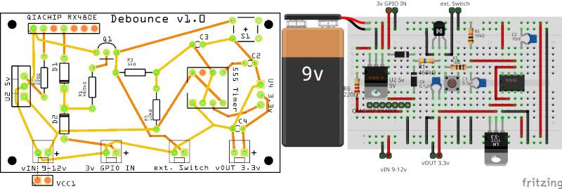
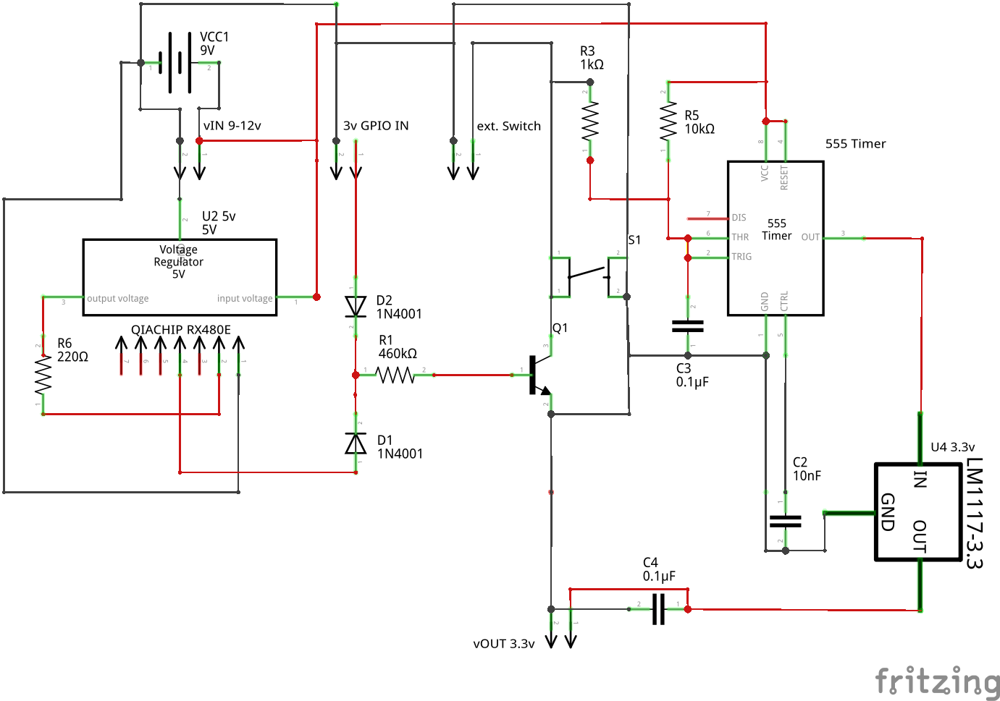
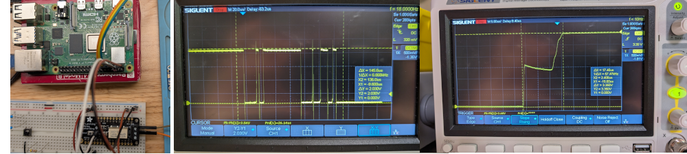

## Hardware Debounce

This project is a hardware device that will take different input signals, debounce them and output a clean trasition from low to high:
   - ext. Switch, any type of external electronic or manual switch
   - a 3v signal from another devices output
   - a momentary button push from a 433*MHZ* transmitter.
   - the momentary switch on the PCB



<details>
<summary>Schematic</summary>

   
</details>


#### Testing:
- Tested using raspberry pi 4 with Adafruit FeatherWing relay switch.
     - <details>
         <summary>Code with explanation and images</summary>

         - Image 1: Raspberry pi 4 activates relay switch, then to debounce switch input, pi also listens for response from  debounce.
           <details>
               <summary>code to randomly activate relay</summary>

               ```
               import RPi.GPIO as GPIO # Import the RPi.GPIO library
               from time import sleep # Import the sleep function
               import random

               # Set the GPIO pin numbering mode to BCM (Broadcom SOC channel)
               GPIO.setmode(GPIO.BCM)
               num = 1
           
               output_pin = 4
               GPIO.setup(output_pin, GPIO.OUT)

               try:
                   while True:
                   # Set the pin to HIGH (3.3V)
                       random_delay = random.uniform(0.1, 3.0)
                       sleep(random_delay)
                       GPIO.output(output_pin, GPIO.HIGH)
                       print("GPIO HIGH")
                       print(num)
                       num += 1
                       # Set the pin to LOW (0V)
                       random_delay = random.uniform(0.2, 0.5)
                       sleep(random_delay) # Wait for 1 second
                       GPIO.output(output_pin, GPIO.LOW)
               except KeyboardInterrupt:
                   # Trap a KeyboardInterrupt (e.g., CTRL+C) to clean up
                   print("Exiting program")
                   GPIO.cleanup() # Reset all GPIO ports used by this program to their default state
               ```
           </details>
           
           <details>
               <summary>code to listen for debounced signal</summary>
               ```
               import RPi.GPIO as GPIO
               import time
               num = 1

               # Function to execute when the interrupt is triggered
               def my_callback(channel):
                   global num
                   print(f"Rising edge detected on GPIO {channel} {num}!")
                   num += 1 
  

               try:
                   # Set up GPIO 27 as an input with a pull-down resistor
                   GPIO.setmode(GPIO.BCM)
                   GPIO.setup(27, GPIO.IN, pull_up_down=GPIO.PUD_DOWN)

                   # Add a rising edge detection event on GPIO 27
                   GPIO.add_event_detect(27, GPIO.RISING, callback=my_callback)

                   # Keep the script running
                   print("Waiting for rising edge on GPIO 27...")
                   while True:
                       time.sleep(1)

               except KeyboardInterrupt:
                   print("\nProgram terminated by user")
               finally:
                   GPIO.cleanup() # Clean up all GPIO resources
               ```
           </details>

            - 36 hours, 185,925 random noisy switch activations debounced with 2 single bounce events registered.
           
         - Image 2: Noisy signal ~5 bounces within 145*uS*
         - three 3: This represents a clean transition 17.4*uS* 
         
     </details>
