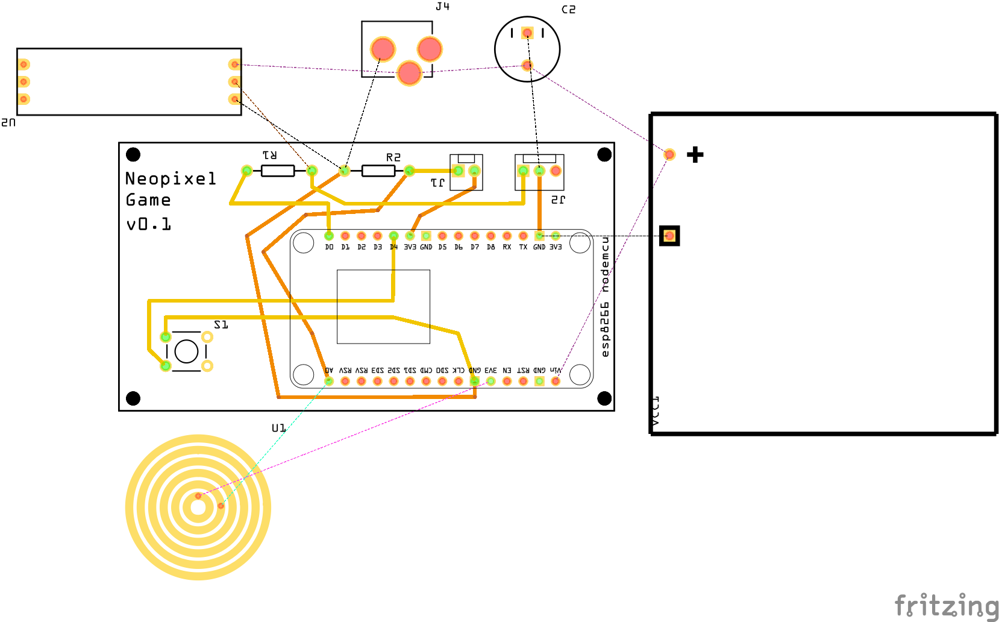

This game uses a touch sensor and neopixel. The player is asked to push the touch sensor, the greater number of LED's lit indicates their electronics geek level. The object is to figure out how to light all the LED's :-)

Bread Board:

Schematic:

PCB:

PCB_QC:

