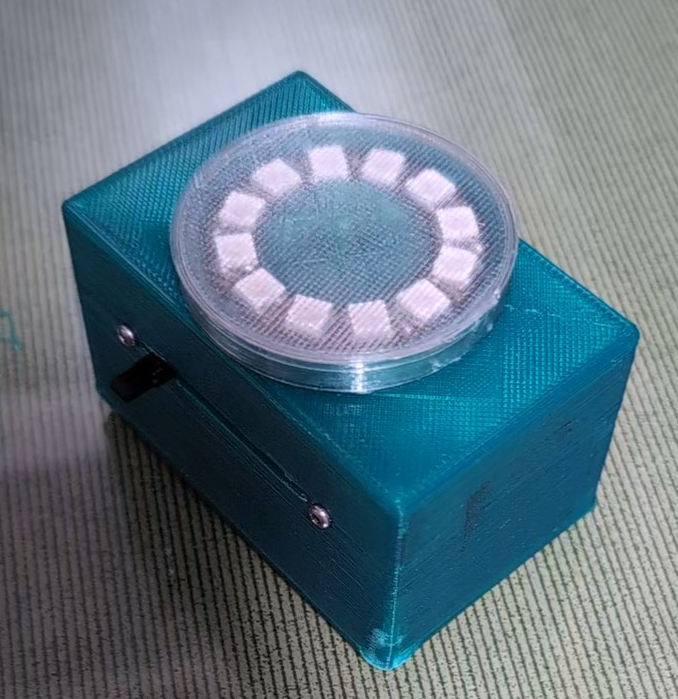
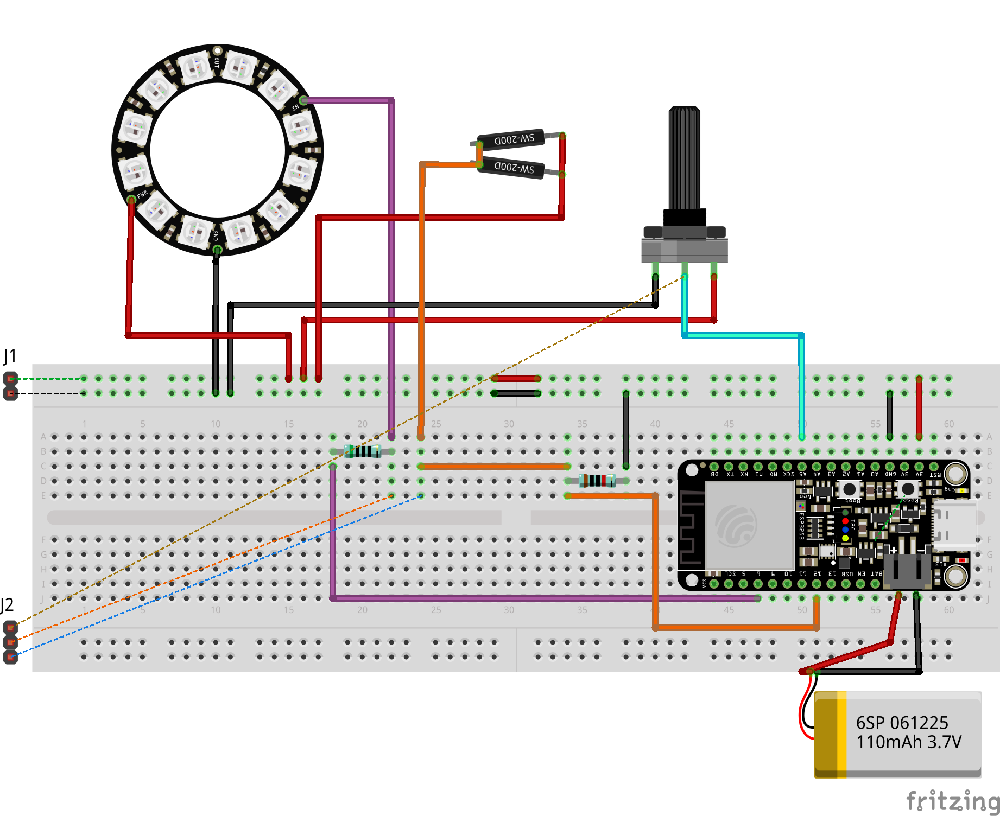
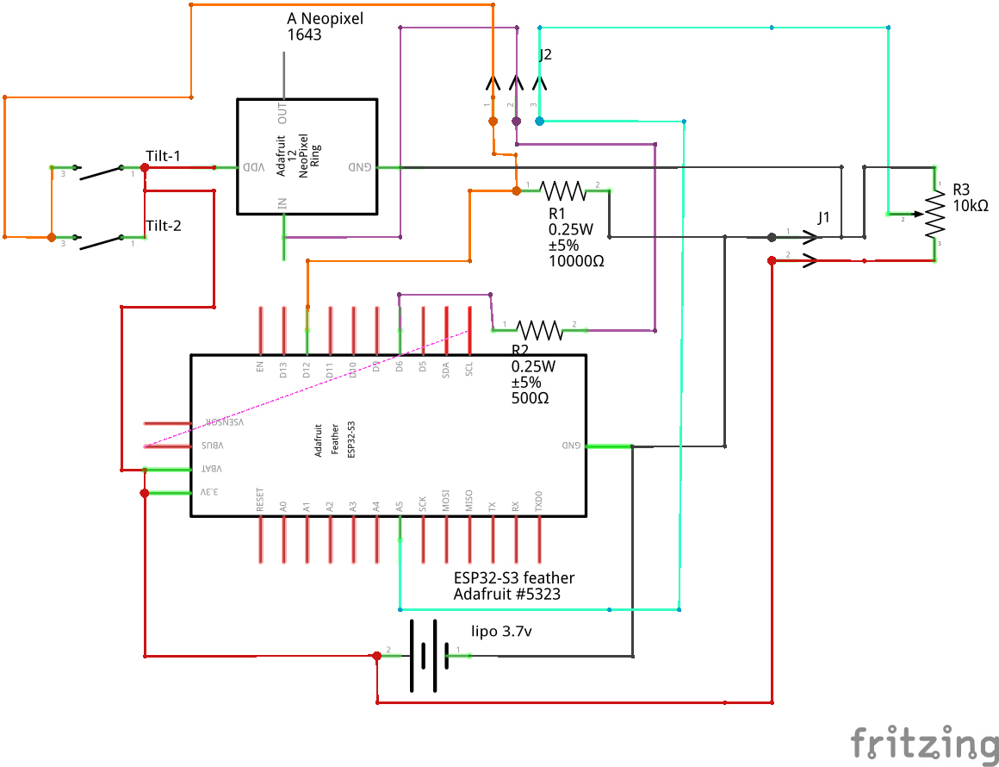
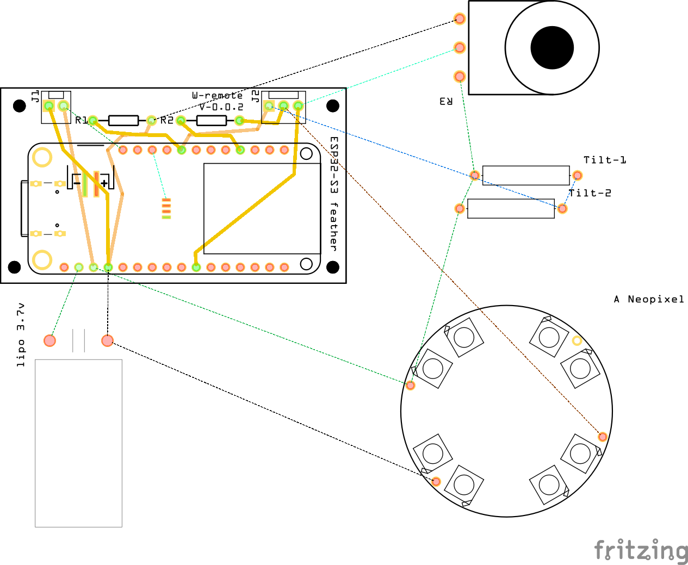

 Ver:0.3

I came up with this project as a way to make use of the 12 light Neopixel I had purchased to learn about NeoPixel. I want the device to be a fun way to control lights or sound volume.

- Box to house project.
- Sleep after a period of inactivity.
- Sensor to detect if picked up and wake up.
- Battery powered with monitoring.
- Indicators for connectivity and battery level via neopixel.

Currently the device will be using [MQTT](https://mqtt.org/) to communicate. The receiving device would subscribe to the messages that this device sends to an MQTT server. Here is the [arduino code](arduino_using_mqtt/arduino_using_mqtt.ino) to communicate via MQTT.

Other possibilities could be?
- Offering some sort of API?
- Sending to another device via rest?

Breadboard:

Schematic:

PCB:

